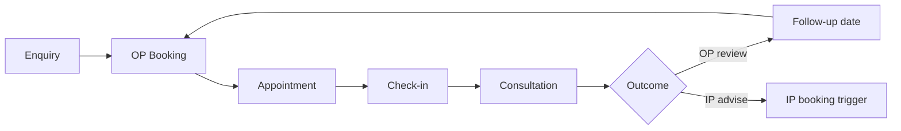
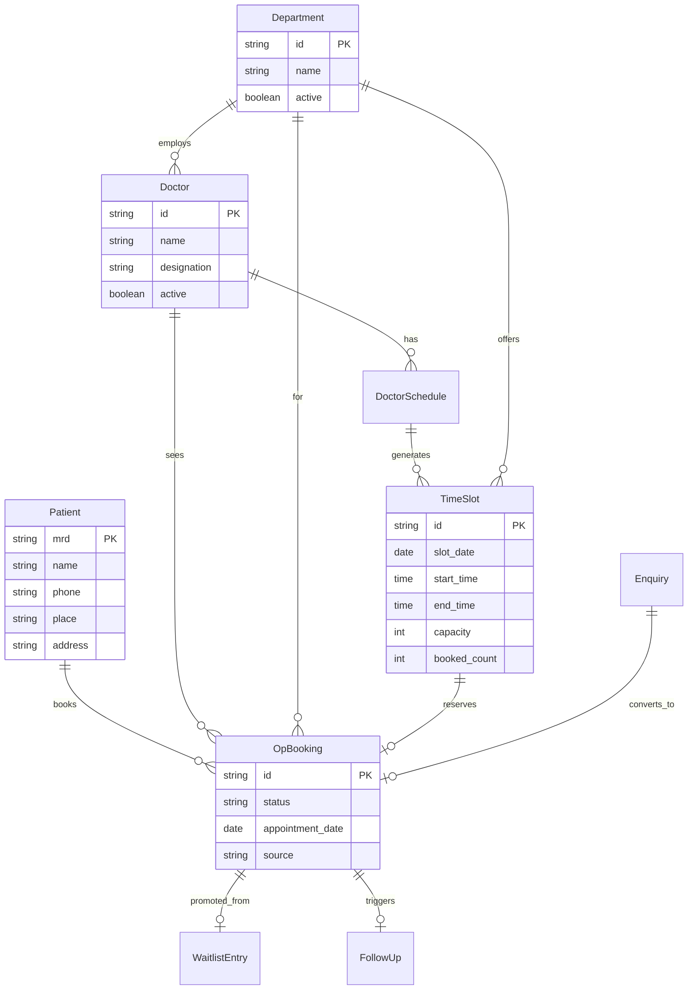

# Data Model — Sreedhareeyam PRM Platform (OP booking → full PRM)

Design reference for the Patient Relationship Management system at Sreedhareeyam Ayurveda Hospital.
This document defines entities, fields, relationships, status values, and sample data.

> **Scope (evolving).** This repo began as **OP appointment scheduling** and is being grown into a
> full **Patient Relationship Management (PRM)** platform — lead capture, call centre, consultation
> coordination, referrals, camps, mobile clinics, follow-up, admission conversion, engagement,
> retention, marketing, and management analytics. See [MODULES.md](./MODULES.md) for the complete
> functional spec (16 modules) and the **canonical, machine-validated data model** in
> [`../packages/db/prisma/schema.prisma`](../packages/db/prisma/schema.prisma).
>
> **HIS boundary preserved.** Full clinical records (EMR, prescriptions-of-record, billing,
> pharmacy, lab results) remain in the **HIS**. The PRM tracks *coordination and outcomes*
> (advice, referrals, admission recommendations, follow-ups) and reads patient master from HIS.
> Accommodation/IP booking is handled separately (`accomodation management`).
>
> The OP-scheduling entities documented below (Department, Doctor, DoctorSchedule, TimeSlot,
> Patient, OpBooking, Enquiry, WaitlistEntry, FollowUp, StaffUser) remain the appointment core
> (Module 3) and are **extended** in the Prisma schema: `Enquiry`→`Lead`, `Patient`→360 profile,
> `FollowUp`→follow-up engine, `StaffUser.role`→15 roles. The sections that follow describe that
> scheduling core in prose; the Prisma schema is authoritative for the full PRM entity set.

---

## Patient journey (data touchpoints)



| Stage | Primary entities | Notes |
|-------|------------------|-------|
| Enquiry | `Enquiry` | Lightweight log; may convert to booking |
| Book | `OpBooking`, `Patient`, `Doctor`, `Department`, `TimeSlot` | Patient imported from HIS by MRD/mobile |
| Day-of | `OpBooking.status → checked_in` | Front-desk marks arrival |
| After visit | `FollowUp` | Next OP date or IP re-admission flag |

---

## HIS integration boundary

| Data | Direction | Rule |
|------|-----------|------|
| Patient master (MRD, name, phone, address, place) | HIS → this system | **Read only**; lookup by MRD or mobile |
| Prior visit summary | HIS → this system | Read only; shown on booking form |
| OP appointments created here | This system → HIS | Daily sync feed (future) |
| Clinical notes, prescriptions, treatment | HIS | **Out of scope** — never written from here |

**Patient identifier:** `mrd` (Medical Record Number), also called MRN in some exports. Unique per patient.

---

## Entity relationship overview



---

## Entities

### Department

Clinical department offering OP consultations.

| Field | Type | Required | Constraints | Description |
|-------|------|----------|-------------|-------------|
| `id` | string (UUID) | yes | PK | Internal ID |
| `name` | string | yes | unique | Display name |
| `code` | string | no | unique | Short code (e.g. `OPH`) |
| `active` | boolean | yes | default `true` | Hidden when inactive |
| `created_at` | datetime | yes | | Audit |
| `updated_at` | datetime | yes | | Audit |

**Seed departments** (aligned with hospital v2.5 list):

| name |
|------|
| General |
| Ophthalmology |
| Skin & Allergy |
| Orthopedic |
| Gynecology |
| Dermatology |
| Neurology |
| Lifestyle diseases |

---

### Doctor

Consultant roster. Doctors are **not** tied to a single department in master data; department is chosen per appointment.

| Field | Type | Required | Constraints | Description |
|-------|------|----------|-------------|-------------|
| `id` | string (UUID) | yes | PK | Internal ID |
| `name` | string | yes | | Full name |
| `designation` | string | no | | e.g. Senior Consultant, Medical Officer |
| `registration_no` | string | no | unique | Medical council registration |
| `active` | boolean | yes | default `true` | Excluded from dropdowns when false |
| `created_at` | datetime | yes | | Audit |
| `updated_at` | datetime | yes | | Audit |

---

### DoctorSchedule

Recurring or one-off availability template. Used to generate `TimeSlot` records.

| Field | Type | Required | Constraints | Description |
|-------|------|----------|-------------|-------------|
| `id` | string (UUID) | yes | PK | |
| `doctor_id` | string | yes | FK → Doctor | |
| `department_id` | string | yes | FK → Department | Department for this session |
| `day_of_week` | int | conditional | 0=Sun … 6=Sat | For recurring schedules |
| `specific_date` | date | conditional | | For one-off sessions; mutually exclusive with `day_of_week` |
| `start_time` | time | yes | | Session start (local) |
| `end_time` | time | yes | | Session end; must be after start |
| `slot_duration_minutes` | int | yes | e.g. 15, 20, 30 | Length of each bookable slot |
| `max_patients_per_slot` | int | yes | default `1` | Capacity per slot |
| `active` | boolean | yes | default `true` | |
| `valid_from` | date | no | | Schedule effective start |
| `valid_until` | date | no | | Schedule effective end |

---

### TimeSlot

A bookable window on a specific date. Generated from `DoctorSchedule` or created manually.

| Field | Type | Required | Constraints | Description |
|-------|------|----------|-------------|-------------|
| `id` | string (UUID) | yes | PK | |
| `doctor_id` | string | yes | FK → Doctor | |
| `department_id` | string | yes | FK → Department | |
| `schedule_id` | string | no | FK → DoctorSchedule | Source template |
| `slot_date` | date | yes | | Appointment date |
| `start_time` | time | yes | | |
| `end_time` | time | yes | | |
| `capacity` | int | yes | ≥ 1 | Max bookings |
| `booked_count` | int | yes | ≥ 0, ≤ capacity | Denormalized counter |
| `status` | enum | yes | see below | `open`, `full`, `blocked`, `cancelled` |
| `created_at` | datetime | yes | | |

**Slot status**

| Value | Meaning |
|-------|---------|
| `open` | `booked_count < capacity` |
| `full` | `booked_count = capacity` |
| `blocked` | Manually closed (leave, meeting) |
| `cancelled` | Session cancelled for the day |

---

### Patient

Cached copy of HIS patient master. Refreshed on lookup; not the system of record.

| Field | Type | Required | Constraints | Description |
|-------|------|----------|-------------|-------------|
| `mrd` | string | yes | PK | Medical Record Number |
| `name` | string | yes | | |
| `phone` | string | no | indexed | Primary mobile |
| `alternate_phone` | string | no | | |
| `email` | string | no | | |
| `place` | string | no | | City / locality |
| `address` | string | no | | Full address |
| `gender` | enum | no | `male`, `female`, `other` | |
| `date_of_birth` | date | no | | |
| `is_new` | boolean | yes | | First visit flag (from HIS) |
| `last_visit_date` | date | no | | Most recent OP/IP visit |
| `his_synced_at` | datetime | yes | | Last HIS pull timestamp |

---

### OpBooking

Core appointment record.

| Field | Type | Required | Constraints | Description |
|-------|------|----------|-------------|-------------|
| `id` | string (UUID) | yes | PK | Human-facing booking ref optional |
| `booking_ref` | string | yes | unique | e.g. `OP-2026-000123` |
| `patient_mrd` | string | yes | FK → Patient | |
| `doctor_id` | string | yes | FK → Doctor | |
| `department_id` | string | yes | FK → Department | |
| `time_slot_id` | string | no | FK → TimeSlot | Null for unslotted/walk-in |
| `appointment_date` | date | yes | | |
| `start_time` | time | yes | | Scheduled start |
| `end_time` | time | no | | Scheduled end |
| `status` | enum | yes | see below | Lifecycle state |
| `source` | enum | yes | see below | How booking was created |
| `booked_by` | string | no | | Staff user ID |
| `booked_at` | datetime | yes | | Creation timestamp |
| `checked_in_at` | datetime | no | | Front-desk check-in time |
| `completed_at` | datetime | no | | Consultation finished |
| `cancelled_at` | datetime | no | | |
| `cancellation_reason` | string | no | | |
| `notes` | string | no | | Clerk remarks |
| `enquiry_id` | string | no | FK → Enquiry | If converted from enquiry |
| `waitlist_id` | string | no | FK → WaitlistEntry | If promoted from waitlist |
| `rescheduled_from_id` | string | no | FK → OpBooking | Prior booking if rescheduled |

**Booking status** (`OpBookingStatus`)

| Value | Meaning | Transitions to |
|-------|---------|----------------|
| `requested` | Created, not yet confirmed | `confirmed`, `cancelled` |
| `confirmed` | Slot reserved | `checked_in`, `cancelled`, `rescheduled` |
| `checked_in` | Patient arrived | `completed`, `no_show` |
| `completed` | Consultation done | — |
| `cancelled` | Booking cancelled | — |
| `no_show` | Did not arrive | — |
| `rescheduled` | Superseded by new booking | — |

**Booking source** (`BookingSource`)

| Value | Description |
|-------|-------------|
| `call_centre` | Phone booking clerk |
| `front_desk` | Walk-in at hospital |
| `enquiry` | Converted from enquiry log |
| `waitlist` | Promoted from waitlist |
| `follow_up` | Scheduled at previous discharge/visit |
| `online` | Future patient portal (reserved) |

---

### Enquiry

Lightweight pre-booking log (not a CRM).

| Field | Type | Required | Constraints | Description |
|-------|------|----------|-------------|-------------|
| `id` | string (UUID) | yes | PK | |
| `contact_name` | string | yes | | Caller / patient name |
| `phone` | string | yes | | |
| `mrd` | string | no | FK → Patient | If known patient |
| `department_id` | string | no | FK → Department | Interest |
| `preferred_date` | date | no | | |
| `source` | enum | yes | `phone`, `walk_in`, `referral`, `website` | |
| `handler` | string | no | | Staff who took enquiry |
| `status` | enum | yes | `open`, `converted`, `closed`, `lost` | |
| `notes` | string | no | | |
| `converted_booking_id` | string | no | FK → OpBooking | |
| `created_at` | datetime | yes | | |

---

### WaitlistEntry

When a department/doctor/date is full.

| Field | Type | Required | Constraints | Description |
|-------|------|----------|-------------|-------------|
| `id` | string (UUID) | yes | PK | |
| `patient_mrd` | string | yes | FK → Patient | |
| `doctor_id` | string | no | FK → Doctor | Preferred doctor |
| `department_id` | string | yes | FK → Department | |
| `requested_date` | date | yes | | |
| `fallback_dates` | date[] | no | | Alternative dates |
| `fallback_department_ids` | string[] | no | | Alternative departments |
| `priority` | int | yes | default 0 | Higher = sooner promotion |
| `status` | enum | yes | `waiting`, `promoted`, `expired`, `cancelled` | |
| `promoted_booking_id` | string | no | FK → OpBooking | |
| `created_at` | datetime | yes | | |

---

### FollowUp

Created after consultation or IP discharge; feeds back into new bookings.

| Field | Type | Required | Constraints | Description |
|-------|------|----------|-------------|-------------|
| `id` | string (UUID) | yes | PK | |
| `patient_mrd` | string | yes | FK → Patient | |
| `department_id` | string | yes | FK → Department | |
| `doctor_id` | string | no | FK → Doctor | |
| `due_date` | date | yes | | Suggested return date |
| `type` | enum | yes | `op_review`, `ip_readmission` | |
| `status` | enum | yes | `pending`, `booked`, `done`, `overdue` | |
| `linked_booking_id` | string | no | FK → OpBooking | When converted |
| `origin_booking_id` | string | no | FK → OpBooking | Source visit |
| `notes` | string | no | | |
| `created_at` | datetime | yes | | |

---

### StaffUser

Internal users (call centre, front desk, admin).

| Field | Type | Required | Constraints | Description |
|-------|------|----------|-------------|-------------|
| `id` | string (UUID) | yes | PK | |
| `name` | string | yes | | |
| `email` | string | yes | unique | Login |
| `role` | enum | yes | `clerk`, `front_desk`, `admin` | |
| `active` | boolean | yes | default `true` | |

---

## Key business rules

1. **Slot capacity:** A booking increments `TimeSlot.booked_count`. When `booked_count = capacity`, slot status becomes `full`.
2. **No overbooking** unless admin override flag is added later.
3. **Reschedule:** Old booking → `rescheduled`; new booking links via `rescheduled_from_id`.
4. **HIS lookup required** for returning patients; new patients may be registered in HIS first, then imported by MRD.
5. **Cancelled bookings** free the slot (`booked_count` decremented) if still on the same slot.
6. **Waitlist promotion:** FIFO within same priority; VIP flag can bump `priority`.
7. **Daily reports** aggregate by `appointment_date`, `department_id`, `doctor_id`, and `status`.

---

## Indexes (recommended)

| Table | Columns | Purpose |
|-------|---------|---------|
| `op_bookings` | `appointment_date`, `department_id` | Day view / department calendar |
| `op_bookings` | `doctor_id`, `appointment_date` | Doctor diary |
| `op_bookings` | `patient_mrd` | Patient history |
| `op_bookings` | `status` | Worklists (check-in queue) |
| `time_slots` | `slot_date`, `doctor_id` | Slot search |
| `patients` | `phone` | HIS-style lookup |
| `enquiries` | `status`, `created_at` | Open enquiry list |
| `waitlist_entries` | `requested_date`, `department_id`, `status` | Promotion queue |

---

## Sample data

Representative seed records are in [`sample-data.json`](./sample-data.json).

### Example booking record

```json
{
  "id": "bkg-001",
  "booking_ref": "OP-2026-000042",
  "patient_mrd": "MRD-10482",
  "doctor_id": "doc-003",
  "department_id": "dept-oph",
  "time_slot_id": "slot-2026-06-10-0930",
  "appointment_date": "2026-06-10",
  "start_time": "09:30",
  "end_time": "09:50",
  "status": "confirmed",
  "source": "call_centre",
  "booked_by": "user-clerk-01",
  "booked_at": "2026-06-02T10:15:00+05:30",
  "notes": "First visit — referred by GP"
}
```

### Example patient (HIS cache)

```json
{
  "mrd": "MRD-10482",
  "name": "Lakshmi Nair",
  "phone": "9847012345",
  "place": "Ernakulam",
  "address": "12, MG Road, Ernakulam, Kerala",
  "gender": "female",
  "is_new": false,
  "last_visit_date": "2025-11-14",
  "his_synced_at": "2026-06-02T10:14:55+05:30"
}
```

---

## Reports (data aggregations)

| Report | Group by | Filters |
|--------|----------|---------|
| Bookings by day/week/month | `appointment_date` | department, doctor, status |
| Department utilisation | `department_id` | date range; slots vs bookings |
| Doctor diary | `doctor_id`, `appointment_date` | status |
| No-show rate | `doctor_id` / `department_id` | `status = no_show` |
| Enquiry conversion | `enquiry.source` | converted vs lost |
| Waitlist turnaround | `department_id` | days from entry to promotion |
| Check-in queue | `appointment_date = today` | `status = confirmed` |

---

## Open decisions

| Topic | Options | Notes |
|-------|---------|-------|
| Slot generation | Nightly batch vs on-demand | Affects `TimeSlot` table size |
| Multi-patient slots | Group consultations | `max_patients_per_slot > 1` |
| Doctor–department link | Fixed vs per-session | Current design: per session |
| HIS write-back | Real-time API vs daily export | Accommodation uses daily feed |
| Public booking | Online portal | `source = online` reserved |

---

## Version history

| Date | Change |
|------|--------|
| 2026-06-06 | Initial data model documented (greenfield) |
| 2026-06-07 | Scope expanded from OP scheduling to full PRM. Canonical model moved to `packages/db/prisma/schema.prisma`; functional spec added in `MODULES.md`. HIS boundary retained. |
